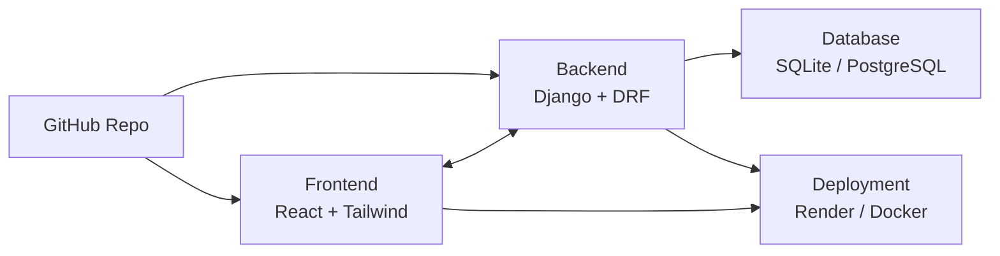

# Store Visit Django + React Project

web site link frontend( https://storevisitdjangoproject-front-demo.onrender.com )

web site link backend (  https://storevisitdjangoproject-backend-demo.onrender.com/admin/login/?next=/admin/)


This is a **full-stack web application** built with:

- **Frontend:** React.js + Tailwind CSS
- **Backend:** Django + Django REST Framework (DRF)
- **Database:** SQLite / PostgreSQL (configurable)
- **Deployment:** Render / Docker
- **Version Control:** Git + GitHub

---

## 🚀 Project Architecture


Dashboard view


create new activities 


complete activity


todays plan


Live map update:


out of range




---

## 📂 Project Structure

```
React and Django/
│── backend/ (Django Project)
│   ├── manage.py
│   ├── storevisitdjangoproject/ (Django settings, urls, wsgi/asgi)
│   ├── apps/ (custom Django apps)
│   └── requirements.txt
│
│── frontend/ (React Project)
│   ├── src/
│   │   ├── components/ (Navbar, Footer, etc.)
│   │   ├── pages/ (Home, Shop, etc.)
│   │   ├── App.js
│   │   └── index.js
│   ├── public/
│   │   └── index.html
│   └── package.json
│
│── .git/ (Git repository)
│── venv/ (Python Virtual Environment - ignored)
│── node_modules/ (React dependencies - ignored)
└── README.md
```

---

## ⚙️ Setup Instructions

### 1. Clone the Repository
```bash
git clone https://github.com/lakshmi863/storevisitdjangoproject.git
cd storevisitdjangoproject
```

### 2. Backend Setup (Django)
```bash
cd backend
python -m venv venv
source venv/bin/activate   # On Windows: venv\Scripts\activate
pip install -r requirements.txt
python manage.py migrate
python manage.py runserver
```

### 3. Frontend Setup (React)
```bash
cd frontend
npm install
npm start
```

---

## 🔑 Features
- JWT Authentication (Login/Register)
- REST API with Django REST Framework
- Responsive UI with Tailwind CSS
- State management in React (Hooks/Context)
- GitHub integration for version control
- Docker/Render deployment ready

---

## 📌 Deployment
- **Render:** Automatic deploys from GitHub
- **Docker:** Containerized setup with Docker Compose

---

## 👨‍💻 Author
**Lakshmi863**  
GitHub: [lakshmi863](https://github.com/lakshmi863)
